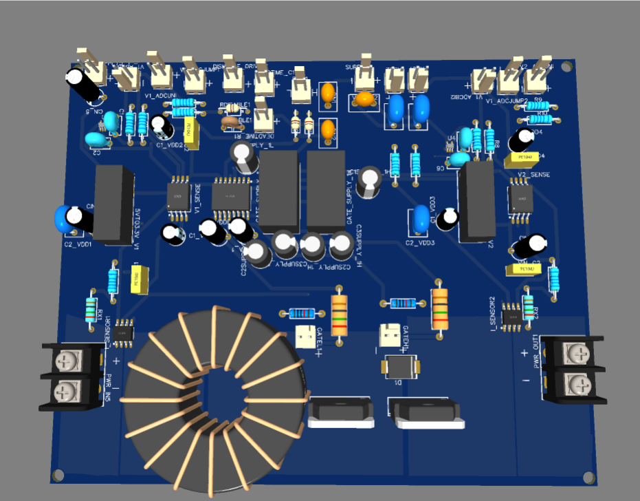
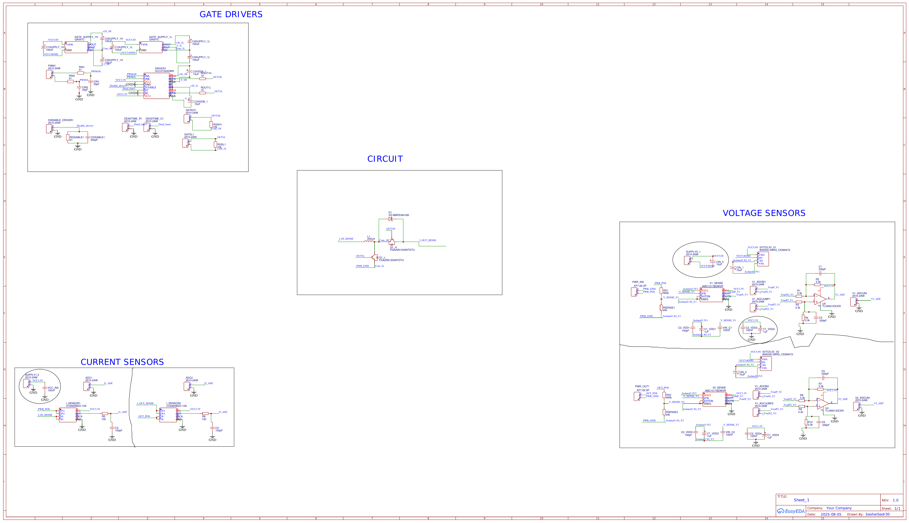
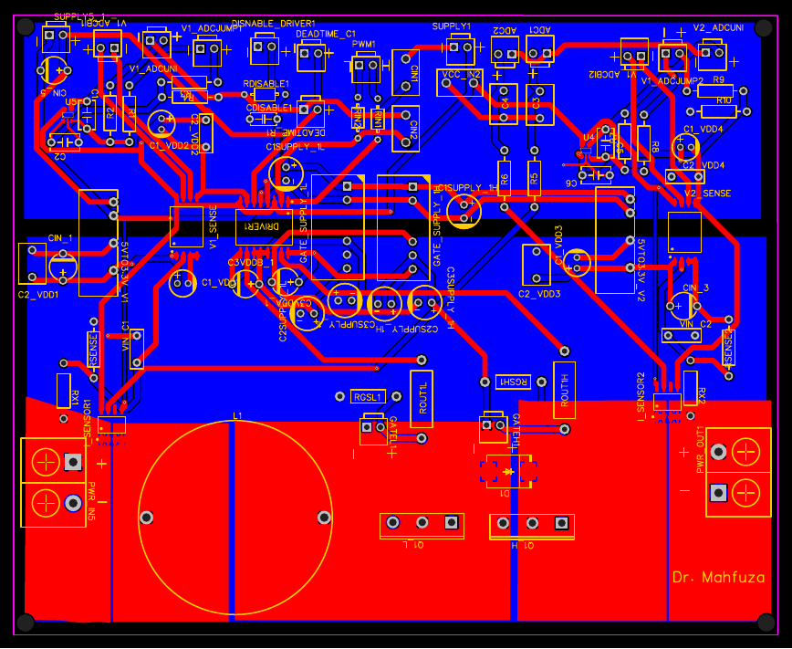

# Boost / Half-Bridge Converter with Integrated Sensing

A self-contained single-leg power converter board — configurable as a boost converter or a half-bridge — integrating the gate driver, dual voltage sensing, and dual current sensing building blocks documented elsewhere in this portfolio onto one PCB with its own inductor and power terminals. Designed in EasyEDA, fabricated and assembled through JLCPCB.

## Overview

Where the [interleaved inverter board](../interleaved-inverter/README.md) replicates the gate driver three times for a multi-phase power stage, this board takes the opposite approach: one leg, but fully instrumented — input and output voltage sensing, input and output current sensing, and the gate drive circuitry, all integrated with the power stage itself (switches, inductor, and freewheeling diode) on a single PCB. It's built to stand alone on the bench as a complete, measurable converter rather than requiring separate sensor boards wired in.

The name reflects that the same power stage topology — two IGBTs (Q1_H, Q1_L) plus an inductor (L1) and a Schottky diode (D1) — can be operated as a **boost converter** (one switch active, the diode as the boost rectifier) or as a **half-bridge** (both switches actively driven, synchronous), depending on how the two PWM channels are driven.

## What's new on this board

Three of the four building blocks are the same designs documented separately in this portfolio, reused directly:

- **Gate driver** — identical to the [standalone UCC21520DWR design](../gate-driver-ucc21520dwr/README.md), one leg
- **Voltage sensing** — two instances of the [AMC1311B design](../voltage-sensor-amc1311/README.md) (V1_SENSE monitors the input, V2_SENSE monitors the output), each with its own isolated 3.3V supply and TLV9001 differential output stage

The current sensing is new — this board uses **CC6920BSO-10A**, a chip flagged early in the project notes as requiring noticeably less external conditioning circuitry than the other options evaluated (TMCS1100, SI8920BC-IPR). That claim holds up here: each current sensor is just the IC, a small RC output filter (100Ω + 100pF), and a 100nF supply decoupling cap — no separate isolated supply, no op-amp conditioning stage, unlike either of the other two current-sensing boards in this portfolio. Two instances are used — I_SENSOR1 on the input current path, I_SENSOR2 on the output.

## Power stage

- **L1** — 250µH inductor (the visible toroidal choke on the board)
- **Q1_H / Q1_L** — FGA25N120ANTDTU IGBTs (1200V), the same part used on the interleaved inverter board
- **D1** — VS-MBRS340-M3 Schottky diode, the boost/freewheeling rectifier
- **PWR_IN5 / PWR_OUT1** — input and output power terminals
- Gate resistors on this board are **10Ω** (matching the standalone gate driver board, not the 22Ω used on the interleaved inverter) — consistent with this being closer to the original bench-test configuration than the higher-power three-phase board.

## Schematic

The schematic is organized into four labeled blocks: GATE DRIVERS, CIRCUIT (the power stage), CURRENT SENSORS, and VOLTAGE SENSORS — making the board's "everything in one place" design intent explicit.

## PCB Layout

## Bill of Materials

28 unique line items — the most complete single-board BOM in this portfolio, reflecting the level of integration. Full BOM: [`BOM.csv`](BOM.csv).

| Part | Function | Qty |
|---|---|---|
| FGA25N120ANTDTU | IGBT, 1200V | 2 |
| UCC21520DWR | Isolated gate driver | 1 |
| QA051C | Isolated bipolar gate supply | 2 |
| AMC1311BDWVR | Isolated voltage sense amplifier | 2 |
| CC6920BSO-10A | Isolated current sensor (minimal conditioning) | 2 |
| TLV9001IDCKR | Voltage-sensor output conditioning op-amp | 2 |
| B0503S-2WR3 | Isolated DC-DC, voltage-sensor supply | 2 |
| L1 — 250µH | Main converter inductor | 1 |
| VS-MBRS340-M3 | Schottky rectifier diode | 1 |
| KF7.62-2P | Input/output power terminals | 2 |

## Usage

- Connect input power to **PWR_IN5**, take converter output from **PWR_OUT1**.
- Drive the leg via **PWM1** (PWMxH/PWMxL pair) — duty cycle and switching pattern determine boost vs. half-bridge behavior.
- Input/output voltage readings are available at **V1_ADCUNI** / **V2_ADCUNI**; input/output current at **ADC1** / **ADC2**.
- **DEADTIME_R1/DEADTIME_C1** and **DISNABLE_DRIVER1** give the same manual deadtime and disable control as the standalone gate driver board.

## Snapshot of the usage 

More result can be found under the published conferece paper titled:
Conducted EMI Reduction in SiC MOSFET-Based Boost Converter using Chaotic Pulse Width Modulation

N.B. The research paper is accepted however it will be published soon.

## Related

Integrates the [gate driver](../gate-driver-ucc21520dwr/README.md) and [voltage sensor](../voltage-sensor-amc1311/README.md) designs directly, and introduces the CC6920BSO-10A current sensor as an alternative to the [SI8920BC-IPR](../current-sensor-si8920/README.md) and [LA55-P](../current-sensor-la55p/README.md) approaches used elsewhere in this portfolio.

---
*The board silkscreen credits "Dr. Mahfuza" — if this board was built as part of that collaboration, worth noting the connection explicitly here.*
