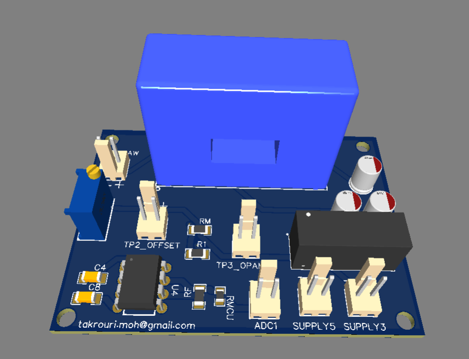
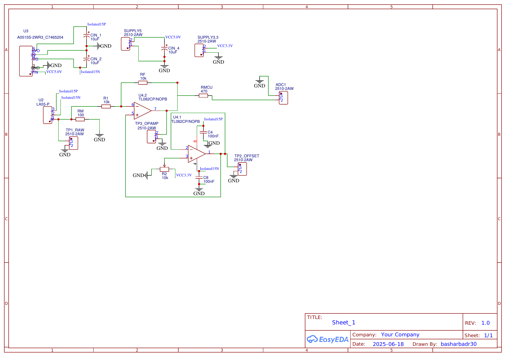
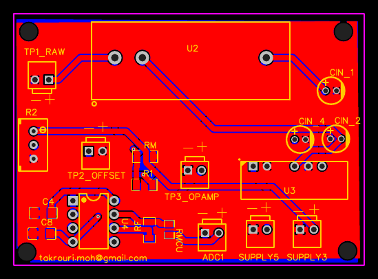

# Hall-Effect Current Sensor — LEM LA55-P

A closed-loop Hall-effect current sensor board built around the LEM LA55-P, with a two-stage op-amp conditioning circuit and a manually-adjustable offset trim — three labeled test points on the silkscreen (RAW → OPAMP → OFFSET) make the signal chain traceable on the bench with just a multimeter. Designed in EasyEDA, fabricated and assembled through JLCPCB.

## Overview

The LA55-P is a closed-loop (compensated) Hall-effect current transducer — the current to be measured passes through the sensor's primary window, and the sensor outputs a scaled current on its secondary that needs to be converted to a voltage and conditioned before an ADC can read it. This board does that conversion, amplifies and buffers the signal, and adds a manual offset trim so the zero-current output point can be tuned on the bench rather than relying purely on component tolerances.

This was noted early on as **"the old way"** compared to the isolated-amplifier + shunt approach used on the SI8920BC-IPR board — LA55-P doesn't need a separate isolation barrier since the Hall sensor itself is inherently isolated, but it does need a dedicated ±15V supply and more analog conditioning than a shunt-based isolated amplifier does.

## Circuit design walkthrough

**Burden resistor (RM).** The LA55-P's secondary output is a current, not a voltage — RM (100Ω) converts it to a voltage by Ohm's law. This raw burden voltage is exposed directly at the **TP1_RAW** test point for bench probing.

**Isolated ±15V supply.** The LA55-P and its conditioning op-amp both need a bipolar ±15V rail. An **A0515S-2WR3** isolated DC-DC module (5V in) generates `Isolated15P`/`Isolated15N`, decoupled with 10µF caps on each rail.

**Stage 1 — inverting gain (U4.2, one half of the TL082).** R1 and RF (both 10kΩ) set this stage as a unity-gain inverting amplifier on the burden voltage, referenced to the board's local ground. Its output is broken out at **TP3_OPAMP**.

**Stage 2 — offset-adjustable output (U4.1, the other half of the TL082).** This stage takes the Stage 1 output and combines it with a manually-adjustable reference set by **R2**, a 10kΩ trimmer potentiometer (visible as the small blue trimpot on the board) between GND and VCC3.3V — its wiper feeds the op-amp's non-inverting input, with C4/C8 (100nF) filtering both supply-referenced nodes for stability. This lets the zero-current output point be tuned by hand on the bench rather than depending purely on resistor tolerances. The result is broken out at **TP2_OFFSET**, then through RMCU (470Ω, a simple series protection resistor) to **ADC1**.

**Why three test points matter in practice:** RAW → OPAMP → OFFSET lets you localize a fault or calibration issue to a specific stage with a multimeter, without needing to probe IC pins directly — useful when this board is buried inside a larger converter assembly.

## Schematic

## PCB Layout

## Bill of Materials

11 unique line items. Full BOM: [`BOM.csv`](BOM.csv).

| Part | Function | Qty |
|---|---|---|
| LA55-P | Closed-loop Hall-effect current transducer | 1 |
| A0515S-2WR3 | Isolated DC-DC, 5V→±15V (sensor + op-amp supply) | 1 |
| TL082CP/NOPB | Dual op-amp — gain stage + offset stage | 1 |
| RM — 100Ω | Burden resistor (I-to-V conversion) | 1 |
| R1, RF — 10kΩ | Stage 1 inverting gain | 2 |
| R2 — 10kΩ trimmer | Manual zero-current offset adjustment | 1 |
| RMCU — 470Ω | Output series protection resistor | 1 |
| C4, C8 — 100nF | Offset-stage supply/reference filtering | 2 |

## Usage

- Route the current-carrying conductor through the LA55-P's primary window (not a screw-terminal connection — this sensor works by the conductor physically passing through the sensor body).
- Power via **SUPPLY5** (5V, feeds the A0515S-2WR3 for the ±15V rail) and **SUPPLY3.3** (3.3V logic reference for the offset trimmer network).
- Before first use, adjust the **R2** trimmer with no current flowing to set the desired zero-current voltage at **TP2_OFFSET** / **ADC1**.
- Take the final conditioned output from **ADC1**. TP1_RAW, TP2_OFFSET, and TP3_OPAMP are available for bench debugging at each stage.

## Status / next steps

- [ ] Bench calibration: known currents vs. ADC1 output, confirm mV/A scaling matches the RM/gain design intent
- [ ] Confirm and document the offset trim procedure/target voltage
- [ ] Bring-up photos and scope captures

## Related

Sibling board to the [SI8920BC-IPR isolated current sensor](../current-sensor-si8920/README.md), [isolated voltage sensor](../voltage-sensor-amc1311/README.md), and [isolated gate driver](../gate-driver-ucc21520dwr/README.md) — part of the same interleaved converter sensing/control stack. This board represents an earlier/alternate current-sensing approach compared to the shunt-based SI8920BC-IPR design.
