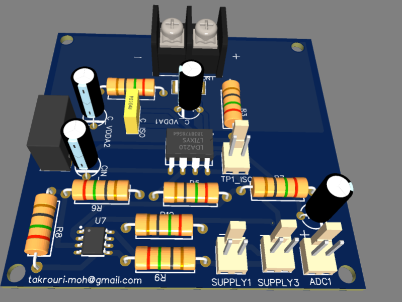
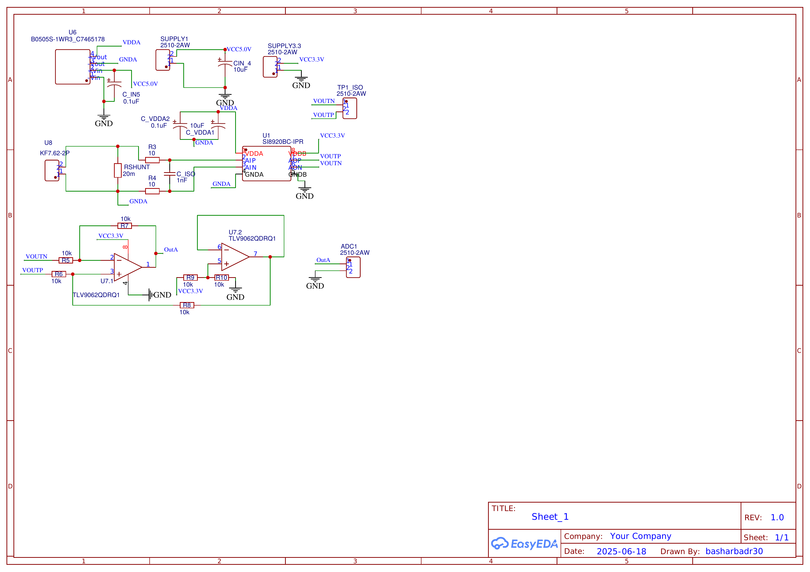
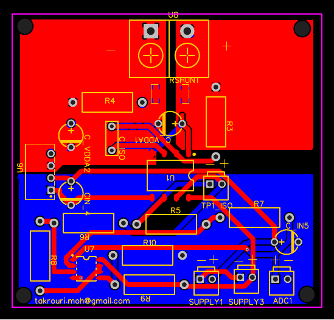

# Isolated Shunt Current Sensor — SI8920BC-IPR

A galvanically isolated current sensing board using a shunt resistor and an isolated amplifier, with a two-stage op-amp conditioning circuit that outputs a bidirectional (positive and negative current) signal centered at mid-supply. Designed in EasyEDA, fabricated and assembled through JLCPCB.

## Overview

Bidirectional current sensing (charge and discharge, motoring and regenerating, etc.) has a specific problem an ordinary unipolar sensor can't solve on its own: the signal needs to represent both positive and negative current, but a single-supply ADC can only read 0V to VCC. This board measures current through a shunt resistor, carries that measurement across an isolation barrier, and then conditions it into a single-ended signal centered at half-supply — so positive current reads above center and negative current reads below it, both safely within the ADC's input range.

## Design evolution — why this chip

Earlier notes in this project explored several current-sensing options before landing here:

- **LEM LA 55-P** — the "old way," but doesn't handle bidirectional current without extra modification
- **CT430** — usable, but its output rides on VCC, which risks overvoltage on the MCU side during a current spike if VCC is set to 5V
- **HLSR-P** — same 0–5V output range issue for a 3.3V-rail MCU
- **TMCS1100** — attractive since it runs off the same 3.3V rail as the MCU, but needs an external mid-supply reference (a chip like REF1933) to represent negative current, since its default reference point doesn't sit at the right voltage for a 3.3V system

The board actually built uses the **SI8920BC-IPR**, an isolated shunt-sensing amplifier, paired with a **20mΩ shunt resistor**. Rather than depending on a dedicated reference IC to get a mid-supply bias (the direction the TMCS1100 notes were heading), the final design generates that reference locally with a resistor divider and buffer — see below.

## Circuit design walkthrough

**Shunt + input filtering.** Current flows through a 20mΩ shunt resistor (RSHUNT) connected across the KF7.62-2P screw terminals — sized for high-current bench connections. R3/R4 (10Ω each) sit between the shunt and the amplifier's AIP/AIN inputs, with a 1nF differential capacitor (C_ISO) across them forming a simple input filter against switching noise before the signal reaches the isolated amplifier.

**Isolation barrier.** The SI8920BC-IPR carries the shunt voltage across an isolation boundary. The primary (shunt) side runs on its own isolated 5V rail from a **B0505S-1WR3** DC-DC module (VDDA/GNDA), decoupled with 10µF + 0.1µF. The secondary (output) side runs on the board's regular 3.3V logic rail (VDDB), with its own ground domain — the PCB layout physically zones these as separate copper regions (visible in the layout image below).

**Stage 1 — difference amplifier (U7.1, half of TLV9062QDRQ1).** The isolated amplifier's differential output (VOUTP/VOUTN) feeds a classic 4-resistor difference amplifier: R5/R6 (10kΩ) on the inputs, R7 (10kΩ) as feedback — unity gain (R7/R5 = 1). Critically, the "+" input's reference isn't tied straight to GND; instead it goes through R8 (10kΩ) to a buffered mid-supply reference from the second op-amp stage. This is what shifts the output so it can represent negative current.

**Stage 2 — buffered mid-supply reference (U7.2, other half of the same chip).** R9/R10 (10kΩ/10kΩ) divide VCC3.3V down to a 1.65V midpoint. The op-amp is wired as a unity-gain buffer (output tied directly back to its inverting input) to give that 1.65V reference enough drive strength to feed into the Stage 1 difference amp without loading it down. This is functionally the same idea as the REF1933-based approach considered earlier for the TMCS1100 option — a stable mid-supply reference for bidirectional signal representation — just implemented with two resistors and half a dual op-amp instead of a dedicated reference IC.

**Result:** `OutA` sits at 1.65V for zero current, rises above 1.65V for current in one direction, and falls below for the other — directly usable by a single-supply ADC.

## Schematic

## PCB Layout

The copper is visibly zoned into two regions — the shunt/isolated-primary side and the logic/secondary side — consistent with maintaining isolation in the physical layout, not just the schematic.

## Bill of Materials

12 unique line items. Full BOM: [`BOM.csv`](BOM.csv).

| Part | Function | Qty |
|---|---|---|
| SI8920BC-IPR | Isolated shunt-sensing amplifier | 1 |
| RSHUNT — 20mΩ | Current shunt | 1 |
| B0505S-1WR3 | Isolated DC-DC, 5V→5V (shunt-side supply) | 1 |
| TLV9062QDRQ1 | Dual op-amp — difference amp + reference buffer | 1 |
| R3, R4 — 10Ω | Shunt-to-amplifier input filter | 2 |
| R5–R10 — 10kΩ | Difference amp + reference divider network | 6 |
| C_ISO — 1nF | Differential input filter | 1 |
| KF7.62-2P | Shunt current input terminal block | 1 |

## Usage

- Pass the current to be measured through the **KF7.62-2P** screw terminals (U8) — this is the shunt/primary side.
- Power the primary side via **SUPPLY1** (5V, feeds the B0505S-1WR3) and the secondary/logic side via **SUPPLY3** (3.3V).
- Take the conditioned, bidirectional output from **ADC1** (`OutA`), centered at 1.65V for zero current.
- **TP1_ISO** exposes the raw differential amplifier output (VOUTP/VOUTN) directly, if needed for debugging or an alternate conditioning path.

## Status / next steps

- [ ] Bench calibration: known bipolar currents vs. measured `OutA` voltage, to confirm the mV/A scaling and 1.65V zero-point
- [ ] Verify shunt power dissipation and thermal behavior at expected continuous current
- [ ] Bring-up photos and scope captures of `OutA` during a current transient

## Related

Sibling board to the [isolated voltage sensor](../voltage-sensor-amc1311/README.md) and [isolated gate driver](../gate-driver-ucc21520dwr/README.md) — part of the same interleaved converter sensing/control stack.
