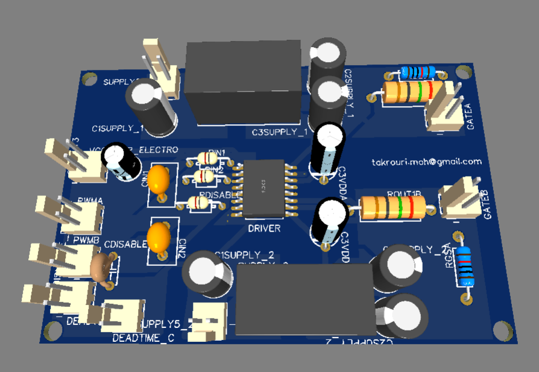
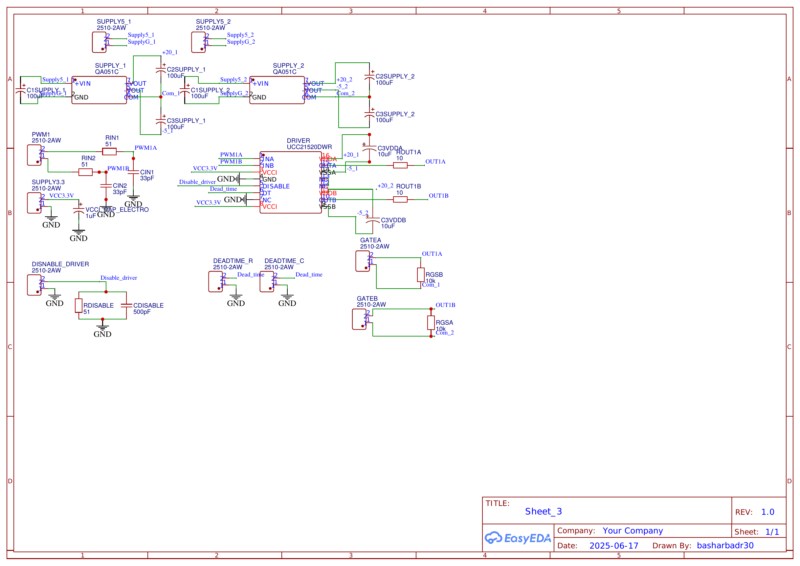
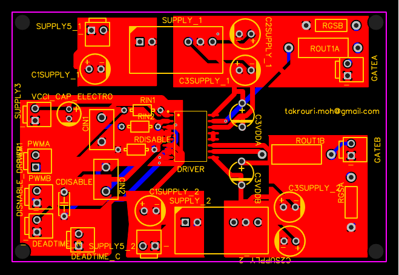

# Isolated Dual-Channel Gate Driver — UCC21520DWR

A reinforced-isolation gate driver board designed to switch a half-bridge (SiC/IGBT) leg, built as a standalone module for use in an interleaved DC-DC converter / inverter stack. Designed in EasyEDA, fabricated at JLCPCB.

## Overview

Gate drive for a half-bridge power stage needs to do three things reliably: level-shift a low-voltage PWM signal to the gate voltages the switch needs, hold galvanic isolation between the control-side logic and the high-voltage switching node, and protect the switch (and the driver) if something goes wrong. This board wraps the **Texas Instruments UCC21520DWR** dual-channel isolated gate driver with the supporting circuitry needed to do that for a single half-bridge leg: input filtering, a bipolar isolated gate supply, gate resistors, and a disable/deadtime interlock.

It's designed as a reusable building block — the same board (three of them) forms the gate drive stage of a larger three-phase interleaved converter.

## Why UCC21520DWR

Before settling on this part, I compared three tiers of gate driver isolation:

| Type | Galvanic isolation | Safety-rated | Typical use |
|---|---|---|---|
| Functional level-shift | No | ❌ | Low-voltage level matching |
| Galvanic — functional | Yes | ❌ | Noise isolation, mid-voltage |
| Galvanic — reinforced | Yes | ✅✅ | High-voltage, safety-critical |

The UCC21520DWR offers **reinforced isolation** on both channels, which matters for a switching node that swings across the DC bus. A bootstrap-supply driver would have been cheaper, but adds design complexity (bootstrap diode/cap sizing, duty-cycle limitations) and doesn't galvanically isolate the low side from the high side. A single-channel reinforced driver was also considered, but two channels in one package meant fewer parts and less board area for the same leg.

## Key design decisions

**Input RC filtering (INA/INB).** Each PWM input gets a small RC low-pass (RIN 51 Ω + CIN 33 pF) between the controller output and the driver pin, giving a corner frequency around 100 MHz — this follows the TI datasheet reference design and knocks down high-frequency switching noise before it reaches the driver's input comparator.

**Bipolar isolated gate supply.** Rather than a single-rail gate supply, each driver output is fed from an isolated **QA051C** DC-DC module configured for **+20 V / −5 V**. The negative rail actively holds the switch off during the off-state, which reduces the risk of parasitic turn-on from Miller current during the complementary switch's turn-on transient — a real concern at the switching speeds SiC/IGBT devices operate at.

**Gate resistors, split.** OUT A/B each go through a 10 Ω series gate resistor (ROUT1A/B) before the gate, with a 10 kΩ gate-source pulldown (RGSA/RGSB) at the switch side to keep the gate defined during power-up/power-down before the driver is fully alive.

**Disable + deadtime interlock.** The DISABLE pin is RC-filtered (RDISABLE 51 Ω, CDISABLE 500 pF) so a legitimate fault signal isn't masked, but transient noise doesn't false-trigger a shutdown. A separate deadtime-setting network (DEADTIME_R / DEADTIME_C) sets the driver's built-in interlock deadtime rather than relying on the controller to guarantee non-overlap in firmware — a hardware backstop in case the PWM source ever glitches.

**VCCI decoupling.** The 3.3 V logic-side supply gets a 1 µF electrolytic in addition to standard ceramic decoupling, since this rail also has to supply the driver's input-side comparator current without sagging during switching edges.

## Schematic

## PCB Layout

Two-layer board, through-hole passives and connectors for easy bench rework, SOIC-16 driver IC. Board net count and connector layout were driven by keeping the isolated (high-side/low-side) gate supply rails and the shared low-voltage logic rail physically separated on the board.

## Bill of Materials

11 unique line items, fully sourced through LCSC/JLCPCB for one-stop fab+assembly. Full BOM: [`BOM.csv`](BOM.csv).

| Part | Function | Qty |
|---|---|---|
| UCC21520DWR | Dual-channel reinforced isolated gate driver | 1 |
| QA051C | Isolated DC-DC, ±gate supply (+20V/−5V per channel) | 2 |
| 51 Ω resistor | INA/INB input filter, DISABLE filter | 3 |
| 33 pF capacitor | INA/INB input filter | 2 |
| 10 Ω resistor | Gate series resistor (ROUT1A/B) | 2 |
| 10 kΩ resistor | Gate-source pulldown (RGSA/RGSB) | 2 |
| 500 pF capacitor | DISABLE pin filter | 1 |
| 100 µF electrolytic | Isolated supply bulk decoupling | 6 |
| 10 µF electrolytic | VDDA/VDDB local decoupling | 2 |
| 1 µF electrolytic | VCCI decoupling | 1 |

## Status / next steps

- [ ] Add bring-up photos and scope captures (PWM in vs. gate voltage out, deadtime measurement)
- [ ] Double-pulse test results
- [ ] Thermal check on QA051C modules under continuous switching load

## Related

Part of a larger interleaved half-bridge / inverter build — see the top-level portfolio README for the full converter stack.
