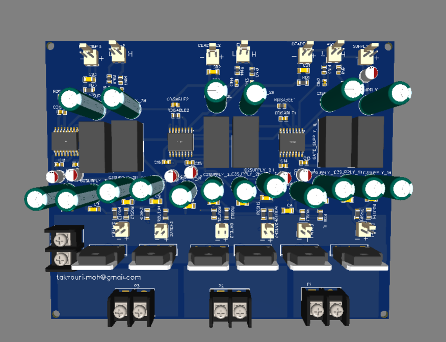
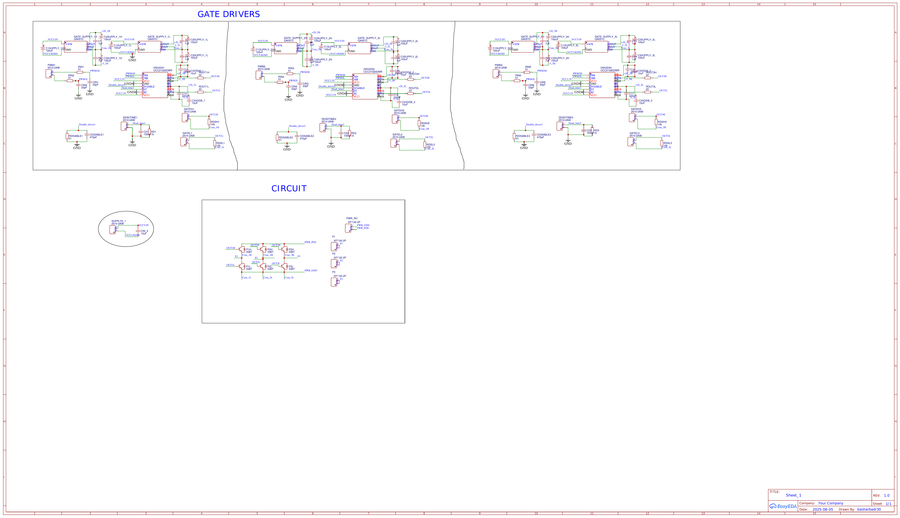
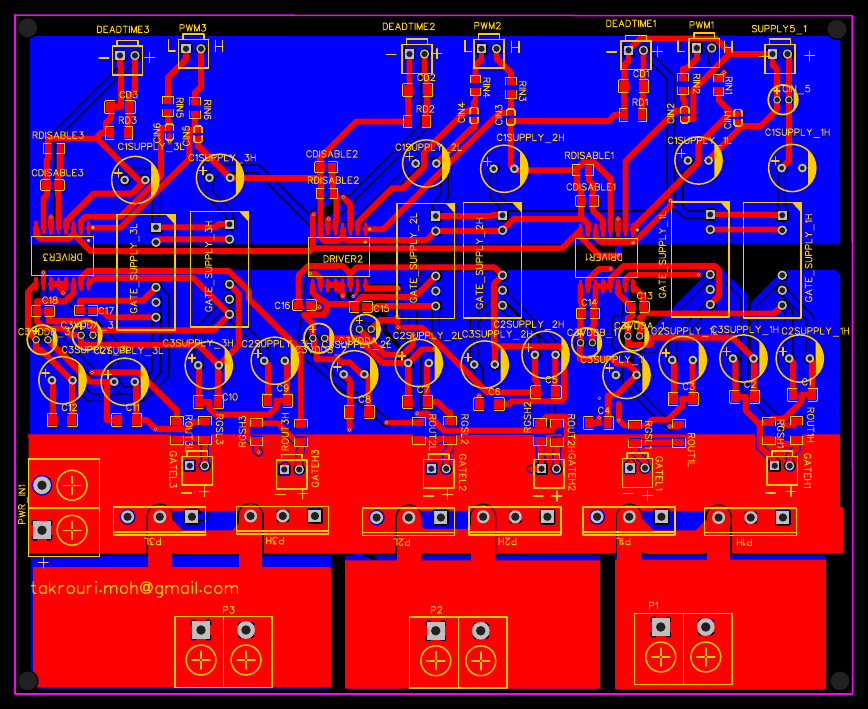

# Three-Phase Inverter / Converter Leg Board

The flagship board of this stack — three complete isolated half-bridge legs on one PCB, each built from the same gate-driver building block documented separately, driving 1200V-rated IGBTs. Designed for a three-phase interleaved DC-DC converter or inverter application. Designed in EasyEDA, fabricated and assembled through JLCPCB.

> **Note on the 3D render:** the electrolytic capacitors shown in this render (the large cylindrical parts) are the EasyEDA 3D models tied to the placeholder footprint used during layout — visually oversized compared to what's actually populated. The board was built with more compact, correctly-rated electrolytics in reality; the render doesn't reflect final physical component size.

## Overview

This board is three copies of the [isolated gate driver design](../gate-driver-ucc21520dwr/README.md) integrated onto a single PCB, each driving one leg (high + low side) of a three-phase power stage using **onsemi FGA25N120ANTDTU IGBTs** (1200V, TO-3P). Three independent, fully isolated gate-drive channels plus a shared DC bus input and three phase outputs make this usable either as a three-phase inverter or as a three-phase interleaved DC-DC converter, depending on how the PWM signals are driven.

Building this as three repeated blocks rather than a single more "optimized" board was a deliberate choice: each leg is electrically and physically identical, which makes the design easier to verify (test one leg, trust the other two work the same way) and easier to debug (a fault on one leg doesn't require re-deriving the whole schematic).

## Architecture

Each of the three legs repeats the full building block documented in the gate driver case study:

- **UCC21520DWR** dual-channel reinforced-isolation driver (DRIVER1/2/3), one per leg, driving both the high-side and low-side switch of that leg
- **Input RC filtering** on both PWM inputs (RIN 51Ω + CIN 33pF per channel) — 6 filter networks total, two per leg
- **Bipolar isolated gate supplies** — two QA051C modules per leg (one for the high-side switch, one for the low side), giving independent +20V/−5V rails for each switch — 6 QA051C modules total
- **Gate resistors + pulldowns** — 22Ω series gate resistor and 10kΩ gate-source pulldown per switch (up from the 10Ω/10kΩ on the standalone gate driver board — see note below)
- **Disable + deadtime interlock** per leg, independently settable per driver (DEADTIME1/2/3, RDISABLE/CDISABLE per leg)

**Gate resistor value change (10Ω → 22Ω).** The standalone gate driver board used 10Ω series gate resistors; this board uses 22Ω. A higher gate resistor slows the switching edge, trading some switching loss for reduced ringing/overshoot — a reasonable adjustment once driving an actual 1200V IGBT under real board parasitics, versus the earlier standalone test board.

**RC snubber network (RD/CD, one per leg).** Each leg adds a 1kΩ + 100nF series RC snubber (RD1–3, CD1–3) — not present on the standalone gate driver board. This is a standard passive snubber for damping voltage ringing at the switching node, appropriate now that this board is actually switching a power stage rather than being bench-tested standalone.

## Schematic

The schematic groups the three identical gate-driver blocks at the top ("GATE DRIVERS") and the shared power circuit (DC bus input, IGBT legs, phase outputs) below ("CIRCUIT") — same layout logic as the PCB itself.

## PCB Layout

The board is visibly organized in horizontal bands: gate-drive/control circuitry along the top (blue), IGBTs and gate connectors in the middle band, and the power terminals (DC bus input, three phase outputs) along the bottom (red) — separating the low-power control section from the high-current power path.

## Bill of Materials

16 unique line items covering all three legs. Full BOM: [`BOM.csv`](BOM.csv).

| Part | Function | Qty |
|---|---|---|
| FGA25N120ANTDTU | IGBT, 1200V (onsemi) | 6 |
| UCC21520DWR | Isolated gate driver | 3 |
| QA051C | Isolated bipolar gate supply (+20V/−5V) | 6 |
| KF7.62-2P | DC bus input + 3× phase output terminals | 4 |
| 100µF electrolytic | Gate supply bulk decoupling | 18 |
| 22Ω resistor | Gate series resistor | 6 |
| 10kΩ resistor | Gate-source pulldown | 6 |
| 51Ω resistor | PWM input filter / DISABLE filter | 9 |
| 33pF capacitor | PWM input filter | 6 |
| 1kΩ resistor | RC snubber | 3 |
| 100nF capacitor | RC snubber | 3 |
| 470pF capacitor | DISABLE pin filter | 3 |
| 10µF electrolytic | VDDA/VDDB local decoupling | 7 |
| 1µF / 220nF ceramic | Misc. decoupling | 18 / 6 |

## Usage

- Connect the DC bus to **PWR_IN1**.
- Drive each leg's high/low PWM pair through **PWM1/2/3** (each a 2-pin header carrying PWMxH and PWMxL).
- Take three-phase output from **P1**, **P2**, **P3**.
- Each leg has its own **DEADTIMEx** and disable-driver line — set independently if the legs need different interlock timing.
- **GATEH1–3 / GATEL1–3** expose each switch's gate/source test points for bench probing.

## Bench Test

N.B. The board has been tested a video will be uploaded later.

## Related

Built from the [isolated gate driver](../gate-driver-ucc21520dwr/README.md) design, replicated three times. Pairs with the [voltage sensor](../voltage-sensor-amc1311/README.md), [SI8920BC-IPR current sensor](../current-sensor-si8920/README.md), and [LA55-P current sensor](../current-sensor-la55p/README.md) boards for full converter measurement and control.
