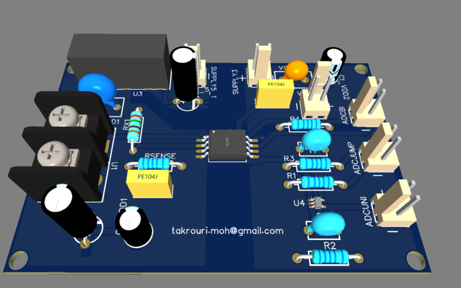
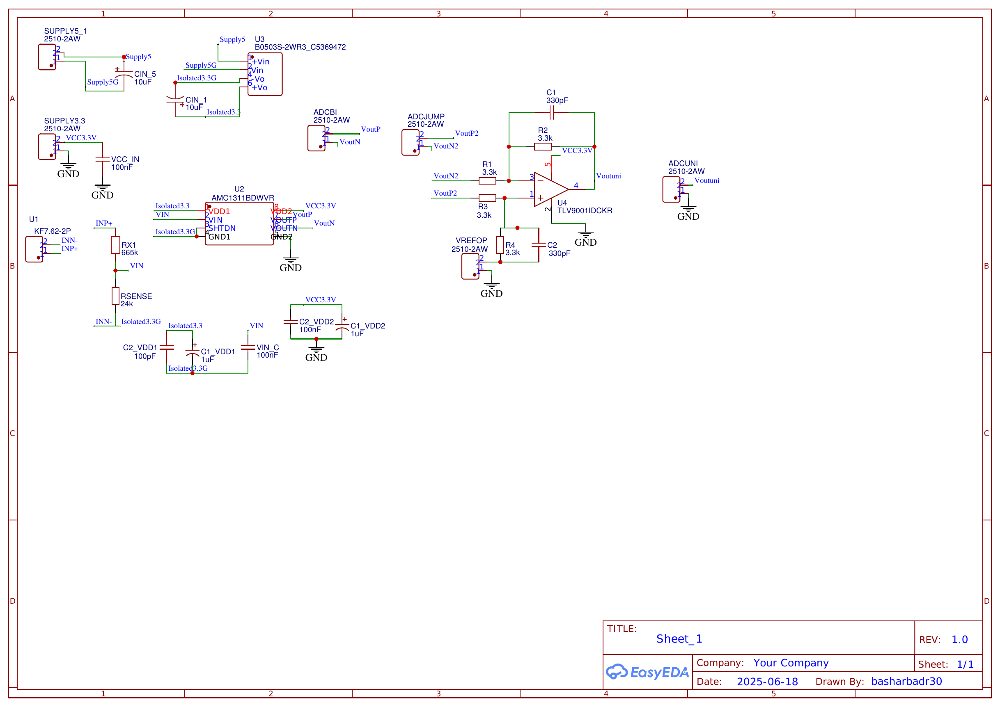
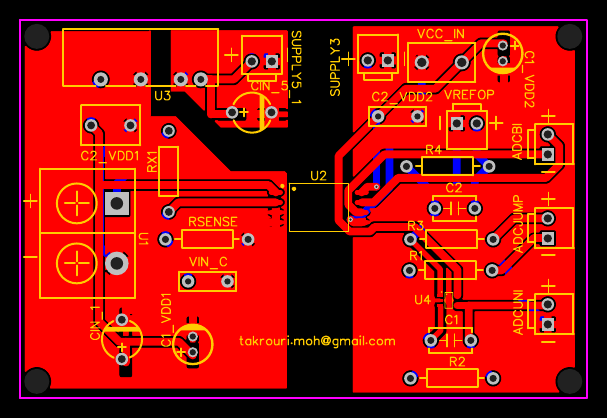

# Isolated Voltage Sensor — AMC1311BDWVR

A galvanically isolated DC voltage sensing board built around TI's AMC1311BDWVR reinforced-isolation amplifier, converting a high-voltage bus measurement into a single-ended, ADC-safe output. Designed in EasyEDA, fabricated and assembled through JLCPCB.

## Overview

Measuring a DC bus voltage safely means solving two problems at once: scaling a potentially high voltage down to something an ADC can read, and doing it without connecting the measurement ground to the control-side ground. This board does both — a resistive divider brings the sensed voltage into range, the AMC1311BDWVR carries that signal across a reinforced isolation barrier, and a differential-to-single-ended output stage conditions the result for a microcontroller ADC input (targeting a TI C2000).

## Why AMC1311B

The AMC1311 was chosen as an isolated voltage-sensing amplifier readily available and assemblable through JLCPCB, with a linear input range that suits bus-voltage sensing applications. The **"B" grade** specifically was selected for its higher input voltage range over the base part — important headroom when the whole point of the divider design is to use as much of the input range as possible without exceeding it.

## Sourcing note

All components on this board were sourced from **Taobao** rather than ordering through LCSC directly, with the PCB itself fabricated and assembled separately through JLCPCB. Worth noting for anyone following a similar approach: EasyEDA's exported BOM (see [`BOM.csv`](BOM.csv)) lists "LCSC" as the supplier for every line — that's EasyEDA's default assembly-service reference, not necessarily where the parts were actually bought from.

## Circuit design walkthrough

**Sensing divider (RX1 + RSENSE).** The design target was 100 µA maximum current through the sense path, with the divider ratio chosen so RSENSE sees at most a 2V drop at full-scale input. For a 60V full-scale measurement, that gives a total divider resistance of ~600 kΩ and an RSENSE value from:

$$R_{SENSE} = \frac{V_{fullscale}}{V_{measure,max} - V_{fullscale}} \times R_{top} = \frac{2V}{58V} \times 600\text{k}\Omega \approx 20.69\text{k}\Omega$$

The built board rounds these to standard E96 values: **RX1 = 665 kΩ**, **RSENSE = 24 kΩ** — both slightly above the calculated targets, which nudges the actual full-scale input a touch below the theoretical 60V. A deliberate margin rather than an error.

**Input filter (VIN_C, 100nF).** The AMC1311's internal modulator samples at 20 MHz, which sets a lower bound on the input filter's cutoff frequency — theoretically only a few pF would suffice. TI's reference design uses a much larger 100pF regardless, since a larger cap gives a lower cutoff and better noise rejection without hurting settling time at this signal bandwidth; this board goes further still with 100nF, prioritizing noise immunity.

**Output conditioning — differential amplifier instead of a clamp diode.** The AMC1311's differential output (VOUTP/VOUTN) sits at GND2 − 0.5V at the low end, below what a C2000 ADC input can safely accept. The initial design notes considered a simple clamping diode to handle this, but the built board instead uses a proper **4-resistor differential amplifier** (R1–R4, all 3.3kΩ) around a TLV9001 op-amp, referenced to a VREFOP input. This both rejects the differential-mode signal correctly and level-shifts the whole thing into a clean, ADC-safe single-ended range — a more robust solution than clamping. C1/C2 (330pF) provide feedback/output filtering on the amplifier stage.

**Isolated supply split.** VDD1 (sense-side, high side) is powered from a **B0503S-2WR3** isolated DC-DC module (5V in, 3.3V out), kept on a separate ground domain (`Isolated3.3G`) from VDD2 (low side, plain VCC3.3V). The PCB layout physically separates the two halves with a visible slot/creepage gap — visible in the layout image below — consistent with maintaining the amplifier's rated isolation in practice, not just on the schematic.

## Schematic

## PCB Layout

Two-layer board with an explicit physical split between the isolated (sense-side) half and the ground-referenced (output/logic) half, joined only through the AMC1311 itself and the isolated DC-DC module — both parts rated for the isolation barrier.

## Bill of Materials

14 unique line items. Full BOM: [`BOM.csv`](BOM.csv).

| Part | Function | Qty |
|---|---|---|
| AMC1311BDWVR | Reinforced-isolation voltage sense amplifier | 1 |
| B0503S-2WR3 | Isolated DC-DC, 5V→3.3V (sense-side supply) | 1 |
| TLV9001IDCKR | Output-stage op-amp (differential-to-single-ended) | 1 |
| RX1 — 665 kΩ | Divider top resistor | 1 |
| RSENSE — 24 kΩ | Divider bottom / sense resistor | 1 |
| R1–R4 — 3.3 kΩ | Differential amplifier network | 4 |
| C1, C2 — 330pF | Output stage filtering | 2 |
| VIN_C — 100nF | AMC1311 input filter | 1 |
| KF7.62-2P | Measured-voltage input terminal block | 1 |
| 2510-2AW connectors | Supply / output headers | 6 |

## Usage

- Connect the voltage to be measured across the **INP+/INN** terminal block (U1) — this is the high-voltage, isolated side.
- Power the isolated side via **SUPPLY5_1** (5V in to the B0503S-2WR3) and the logic side via **SUPPLY3.3** (3.3V for the AMC1311 VDD2 and the TLV9001).
- Take the conditioned, single-ended output from **ADCUNI** (`Voutuni`) into your ADC input. **ADCBI/ADCJUMP** expose the raw differential AMC1311 output pair if you need it directly instead.
- **VREFOP** sets the differential amplifier's output reference level — tie it to your ADC's reference or midpoint as appropriate for your system.

## Status / next steps

- [ ] Bench calibration: known input voltages vs. measured ADC counts, across the full input range
- [ ] Verify actual full-scale input given the rounded RX1/RSENSE values
- [ ] Bring-up photos and any oscilloscope captures of the conditioned output

## Related

Sibling board to the [isolated gate driver](../gate-driver-ucc21520dwr/README.md) — part of the same interleaved converter sensing/control stack.
